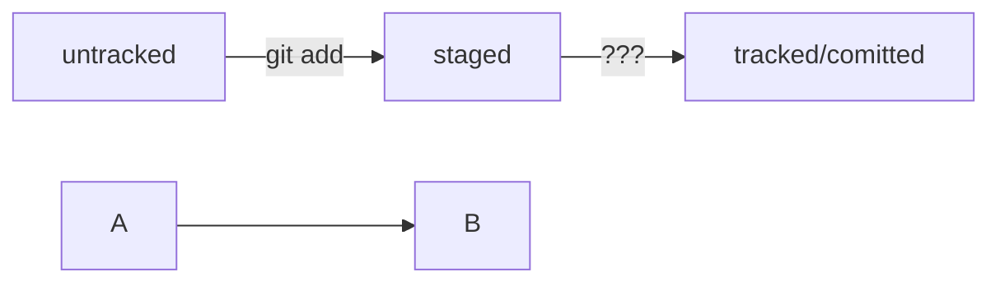

# Удобная шпаргалка по работе с Git  

**Учебный проект-помощник** - краткий справочник для быстрой работы с Git

## Настройка GIT


```	
git version
```
- вывести текущую версию Git


```	
cat ~/.gitconfig  
git config –-list
```
- вывести содержимое файла конфигурации Git

```	
git init 
```
- *от англ. initialize — «инициализировать»* <br>
Сделать папку репозиторием, чтобы Git начал отслеживать изменения в проекте

```	
rm -rf .git  
```
- «Разгитить» папку/ удалить подпапку .git 

**Внимание!** Если удалить .git, то вся история проекта будет стёрта без возможности восстановления — останется только последняя версия файлов.

```	
git status  
```
- Проверить состояние репозитория 


## Командная строка

```
pwd
```
- *print working directory/показать рабочую папку* <br>
показать в какой папке находимся

```
ls
```
- *list directory contents/отобразить содержимое директории* <br>
показать файлы в папке, где мы сейчас (выведет список обычных файлов в директории)

```
cd
```
- *change directory/сменить директорию* <br>
перейти в папку (если в названии папки есть пробелы, то при вводе нужно использовать кавычки, например: cd “Фотографии с дня рождения”)

```
mkdir new-dir
```
- *make directory/создать директорию* <br>
создать папку с именем new-dir в текущей папке

```	
touch index.html
```
- создать файл index.html в текущей папке

```	
touch index.html style.css script.js
```
- если нужно создать несколько файлов, их имена можно вводить через пробел

```	
touch ../../file.txt
```
- создать файл file.txt на две папки выше по иерархии

```	
cp index.html style.css script.js /src
```
- *copy/копировать* <br>
*cp что_копируем куда_копируем* <br>
скопировали три файла (index.html, style.css и script.js) в папку src

```	
mv table.csv ./very-important-files
```
- *move/переместить* <br>
переместить файл в папку (сначала указываем имя файла, который хотим переместить, потом путь — куда перемещаем)

```	
rm about.html
```
- *remove/удалить* <br>
удалить файл about.html из текущей папки

```	
rmdir images
```
- *remove directory/удалить директорию* <br>
удалить папку images (Если в папке, которую вы пытаетесь стереть, есть какие-то файлы, то командная строка не удалит её и выведет сообщение о том, что папка не пуста (Directory not empty)

```	
rm -r second-project
```
- *-r — от англ. recursive, «рекурсивный»* <br>
удалить папку second-project вместе со всем её содержимым. Это значит, что удаление будет последовательно применяться к каждому из элементов в этой папке — пока не сотрёт их все. Затем команда удалит пустую директорию

**Внимание!** Удаление объектов командами **rm** и **rmdir** необратимо — в этом случае файлы и папки не попадают в корзину и исчезают навсегда.

## Команды, чтобы сделать сохранение — коммит

```	
git add название_файла
```
- готовим выбранный файл к коммиту

```	
git add -A 
git add –all
```
- чтобы ничего не потерять, можно подготовить к коммиту сразу все файлы, в которых были изменения

**Внимание!** Сохранения пока не произошло, потому что команда *git add* только запоминает текущее содержимое (контент) файла, она не сохраняет содержимое файлов в репозитории. <br>
Само сохранение, или фиксацию состояния файлов, называют коммитом (*commit/совершать, фиксировать*). «Сделать коммит» значит сохранить текущую версию файла.

```	
git commit -m "комментарий к коммиту"
```
- сделать коммит с комментарием. Обычно в комментарии поясняется, в чем именно состоят изменения

```	
git commit --amend
```
- добавить изменения к последнему коммиту

```	
git log
```
- *от англ. log — «журнал [записей]»* <br>
посмотреть подробный лог коммитов. По умолчанию *git log* выводит коммиты в обратном хронологическом порядке — последние коммиты оказываются первыми сверху

## Команды для синхронизации локального репозитория с удалённым

```	
git remote add origin git@github.com:%ИМЯ_АККАУНТА%/first-project.git
```
- *remote/удалённый, add/добавить* <br>
находясь в папке с локальным репозиторием, привязываем его к удалённому <br>
команде необходимо передать два параметра: имя удалённого репозитория и его URL. В качестве имени используется слово origin <br>
*origin (англ. «источник») — стандартный псевдоним, с помощью которого можно обращаться к главному удалённому репозиторию (обычно такой репозиторий один). Это значительно упрощает работу*

```	
git push -u origin main
```
- заливаем все файлы из локального репозитория в удалённый, который уже привязали


