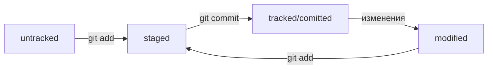

# Удобная шпаргалка по работе с Git  

**Учебный проект-помощник** - краткий справочник для быстрой работы с Git

## Настройка GIT

``` 
git version
```
- вывести текущую версию Git

``` 
cat ~/.gitconfig  
git config –-list
```
- вывести содержимое файла конфигурации Git

``` 
git init 
```
- *от англ. initialize — «инициализировать»* <br>
сделать папку репозиторием, чтобы Git начал отслеживать изменения в проекте

``` 
rm -rf .git  
```
- «Разгитить» папку/ удалить подпапку .git 

**Внимание!** Если удалить .git, то вся история проекта будет стёрта без возможности восстановления — останется только последняя версия файлов.

``` 
git status  
```
- проверить состояние репозитория 

``` 
git status --ignored 
```
- отобразить все игнорируемые файлы. В таком случае в выводе git status появится раздел Ignored files

## Командная строка

```
pwd
```
- *print working directory/показать рабочую папку* <br>
показать в какой папке находимся

```
ls
```
- *list directory contents/отобразить содержимое директории* <br>
показать файлы в папке, где мы сейчас (выведет список обычных файлов в директории)

```
cd
```
- *change directory/сменить директорию* <br>
перейти в папку (если в названии папки есть пробелы, то при вводе нужно использовать кавычки, например: cd “Фотографии с дня рождения”)

```
mkdir new-dir
```
- *make directory/создать директорию* <br>
создать папку с именем new-dir в текущей папке

``` 
touch index.html
```
- создать файл index.html в текущей папке

``` 
touch index.html style.css script.js
```
- если нужно создать несколько файлов, их имена можно вводить через пробел

``` 
touch ../../file.txt
```
- создать файл file.txt на две папки выше по иерархии

``` 
cp index.html style.css script.js /src
```
- *copy/копировать* <br>
*cp что_копируем куда_копируем* <br>
скопировали три файла (index.html, style.css и script.js) в папку src

``` 
mv table.csv ./very-important-files
```
- *move/переместить* <br>
переместить файл в папку (сначала указываем имя файла, который хотим переместить, потом путь — куда перемещаем)

``` 
rm about.html
```
- *remove/удалить* <br>
удалить файл about.html из текущей папки

``` 
rmdir images
```
- *remove directory/удалить директорию* <br>
удалить папку images (Если в папке, которую вы пытаетесь стереть, есть какие-то файлы, то командная строка не удалит её и выведет сообщение о том, что папка не пуста (Directory not empty)

``` 
rm -r second-project
```
- *-r — от англ. recursive, «рекурсивный»* <br>
удалить папку second-project вместе со всем её содержимым. Это значит, что удаление будет последовательно применяться к каждому из элементов в этой папке — пока не сотрёт их все. Затем команда удалит пустую директорию

**Внимание!** Удаление объектов командами **rm** и **rmdir** необратимо — в этом случае файлы и папки не попадают в корзину и исчезают навсегда.

``` 
cat myfile.txt
```
- *concatenate and print — «объединить и распечатать»* <br>
распечатать то, что содержится в указанном файле. Команда cat работает только с текстовыми файлами

``` 
echo "Новая строка" >> file.txt
```
- дописать строку в файл <br>

💡 *Сама по себе эта команда просто выводит в консоль то, что ей передали в качестве параметра. Но если скомбинировать echo с символами перенаправления вывода >> (два знака «больше»), то всё, что должно было попасть на экран, вместо этого будет записано в файл* <br>
*Оператор >> — это возможность командной строки (Bash). Его можно использовать не только с echo, но и с любой другой командой, которая выводит что-то на экран* <br>
*Одинарный символ > тоже перенаправит вывод команды в файл, но перед этим сотрёт содержимое файла, то есть перезапишет файл целиком*

## Статусы файлов в Git

- **untracked** (*англ. «неотслеживаемый»*) <br>
Новые файлы в Git-репозитории помечаются как untracked, то есть неотслеживаемые. Git «видит», что такой файл существует, но не следит за изменениями в нём. У untracked-файла нет предыдущих версий, зафиксированных в коммитах или через команду git add. 

- **staged** (*англ. «подготовленный»*) <br>
После выполнения команды git add файл попадает в staging area (от англ. stage — «сцена», «этап (процесса)» и area — «область»), то есть в список файлов, которые войдут в коммит. В этот момент файл находится в состоянии staged.

💡 *Staging area также называют index (англ. «каталог») или cache (англ. «кеш»), а состояние файла staged иногда называют indexed или cached.*
*Все три варианта могут встречаться в документации и в качестве флагов команд Git.*

- **tracked** (*англ. «отслеживаемый»*) <br>
Состояние tracked — это противоположность untracked. Оно довольно широкое по смыслу: в него попадают файлы, которые уже были зафиксированы с помощью git commit, а также файлы, которые были добавлены в staging area командой git add. То есть все файлы, в которых Git так или иначе отслеживает изменения. 

- **modified** (*англ. «изменённый»*) <br>
Состояние modified означает, что Git сравнил содержимое файла с последней сохранённой версией и нашёл отличия. Например, файл был закоммичен и после этого изменён. 

## Типичный жизненный цикл файла в Git



## Команды, чтобы сделать сохранение — коммит

``` 
git add название_файла
```
- готовим выбранный файл к коммиту

``` 
git add -A 
git add –all
```
- чтобы ничего не потерять, можно подготовить к коммиту сразу все файлы, в которых были изменения

**Внимание!** Сохранения пока не произошло, потому что команда *git add* только запоминает текущее содержимое (контент) файла, она не сохраняет содержимое файлов в репозитории. <br>
Само сохранение, или фиксацию состояния файлов, называют коммитом (*commit/совершать, фиксировать*). «Сделать коммит» значит сохранить текущую версию файла.

``` 
git commit -m "комментарий к коммиту"
```
- сделать коммит с комментарием. Обычно в комментарии поясняется, в чем именно состоят изменения

``` 
git log
```
- *от англ. log — «журнал [записей]»* <br>
посмотреть подробный лог коммитов. По умолчанию *git log* выводит коммиты в обратном хронологическом порядке — последние коммиты оказываются первыми сверху

``` 
git log --oneline
```
- получить сокращённый лог. В терминале появятся только первые несколько символов хеша каждого коммита и их комментарии 

## Команды для исправления коммита

``` 
git commit --amend
```
- *от англ. amend — «исправить», «дополнить»* <br>
добавить изменения к последнему коммиту

**Внимание!** Опция --amend работает только с последним коммитом (HEAD). Для исправления более ранних коммитов есть другие команды 

``` 
git commit --amend --no-edit
```
- дополнить коммит новыми файлами. --no-edit сообщает команде commit, что сообщение коммита нужно оставить как было

``` 
git commit --amend -m "Обновлённое сообщение коммита"
```
- изменить сообщение коммита

## Как откатиться назад, если «всё сломалось»

``` 
git restore --staged <file>
```
- перевести файл из staged обратно в modified или untracked

``` 
git restore --staged 
```
- «сбросить» все файлы из staged обратно в untracked/modified, команда сбросит всю текущую папку (.)

``` 
git reset --hard <commit hash>
```
- *от англ. reset  — «сброс», «обнуление» и hard — «суровый»* <br> 
«откатить» коммит до коммита с хешем **hash**. "Жесткий" сброс вернет репозиторий к более раннему коммиту. История после этого коммита будет потеряна

``` 
git restore <file> 
```
- «откатить» изменения, которые не попали ни в staging, ни в коммит. Изменения в файле «откатятся» до последней версии, которая была сохранена через git commit или git add

## Команды для просмотра изменения в файлах

``` 
git diff
```
- *от англ. difference — «отличие», «разница»* <br>
сравнить последнюю закоммиченную версию файла с той, что находится в состоянии modified <br>
*по умолчанию команда git diff не показывает изменения в staged-файлах — только в modified*

``` 
git diff --staged
```
- показать изменения в staged-файлах относительно последних закоммиченных версий

💡 *Самое важное git diff выводит в конце:* <br>
- *красный цвет строки никого нет значит, что эта строка была удалена;* <br>
- *зелёный цвет строки Мышка-норушка значит, что она была добавлена* <br>

*Не все консоли умеют выводить цвета, поэтому строки помечаются не только цветом, но и знаком - или +. Минус — это удалённые строки, плюс — это добавленные.*<br>

*Коротко про остальные строки вывода команды:* <br>
- *Первые две строки (diff --git a/... b/... и index 901da07..ac459e1 100644) — это низкоуровневая техническая информация* <br>
- *Строки --- a/file и +++ b/file говорят, что дальше будет выведен результат сравнения файлов a/file и b/file — исходной и текущей версий* <br>
- *Строка @@ -1,2 +1,2 @@ сообщает, какие строки файла попали в сравнение. Выражение 1,2 (неважно, с плюсом или с минусом) говорит, что были использованы две строки, начиная с первой.* *Если бы было, например, написано +15,7, это значило бы, что в сравнении участвуют 7 строк, начиная с 15-й* <br>
*Выражение со знаком минус (-1,2) относится к «оригинальной» версии файла (a/file), а со знаком плюс (+1,2) — к «изменённой» (b/file)*

``` 
git diff <коммит1> <коммит2>
```
- сравнивать изменения в двух коммитах


## Команды для синхронизации локального репозитория с удалённым

``` 
git remote add origin git@github.com:%ИМЯ_АККАУНТА%/first-project.git
```
- *remote/удалённый, add/добавить* <br>
находясь в папке с локальным репозиторием, привязываем его к удалённому <br>
команде необходимо передать два параметра: имя удалённого репозитория и его URL. В качестве имени используется слово origin <br>
*origin (англ. «источник») — стандартный псевдоним, с помощью которого можно обращаться к главному удалённому репозиторию (обычно такой репозиторий один). Это значительно упрощает работу*

``` 
git push -u origin main
```
- заливаем все файлы из локального репозитория в удалённый, который уже привязали
