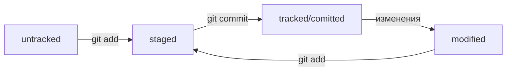

# Удобная шпаргалка по работе с Git  

**Проект-помощник** - краткий справочник для быстрой работы с Git

## СОДЕРЖАНИЕ

[Настройка Git](#настройка-git) <br>
[Командная строка](#командная-строка) <br>
[Статусы файлов в Git](#статусы-файлов-в-git) <br>
[Типичный жизненный цикл файла в Git](#типичный-жизненный-цикл-файла-в-git) <br>
[Команды, чтобы сделать сохранение - коммит](#команды-чтобы-сделать-сохранение---коммит) <br>
[Команды для исправления последнего коммита](#команды-для-исправления-последнего-коммита) <br>
[Команды для "отката" файлов и коммитов](#команды-для-отката-файлов-и-коммитов) <br>
[Команды для просмотра изменения в файлах](#команды-для-просмотра-изменения-в-файлах) <br>
[Команды для синхронизации локального репозитория с удалённым](#команды-для-синхронизации-локального-репозитория-с-удалённым) <br>
[Работа с ветками](#работа-с-ветками) <br>
[Командная работа в Git](#командная-работа-в-git) <br>


## Настройка Git

``` 
git version
```
- вывести текущую версию Git

``` 
cat ~/.gitconfig  
git config –-list
```
- вывести содержимое файла конфигурации Git

``` 
git init 
```
- *initialize/инициализировать* <br>
сделать папку репозиторием, чтобы Git начал отслеживать изменения в проекте

``` 
rm -rf .git  
```
- «Разгитить» папку/ удалить подпапку .git 

⚠️ Если удалить .git, то вся история проекта будет стёрта без возможности восстановления — останется только последняя версия файлов.

``` 
git status  
```
- проверить состояние репозитория 

``` 
git status --ignored 
```
- отобразить все игнорируемые файлы. В таком случае в выводе git status появится раздел Ignored files

<p align="right"><a href="#содержание">Вернуться к содержанию</a></p>

## Командная строка

```
pwd
```
- *print working directory/показать рабочую папку* <br>
показать в какой папке находимся

```
ls
```
- *list directory contents/отобразить содержимое директории* <br>
показать файлы в папке, где мы сейчас (выведет список обычных файлов в директории)

```
cd
```
- *change directory/сменить директорию* <br>
перейти в папку (если в названии папки есть пробелы, то при вводе нужно использовать кавычки, например: cd “Фотографии с дня рождения”)

```
mkdir new-dir
```
- *make directory/создать директорию* <br>
создать папку с именем new-dir в текущей папке

``` 
touch index.html
```
- создать файл index.html в текущей папке

``` 
touch index.html style.css script.js
```
- если нужно создать несколько файлов, их имена можно вводить через пробел

``` 
touch ../../file.txt
```
- создать файл file.txt на две папки выше по иерархии

``` 
cp index.html style.css script.js /src
```
- *copy/копировать* <br>
*cp что_копируем куда_копируем* <br>
скопировали три файла (index.html, style.css и script.js) в папку src

``` 
mv table.csv ./very-important-files
```
- *move/переместить* <br>
переместить файл в папку (сначала указываем имя файла, который хотим переместить, потом путь — куда перемещаем)

``` 
rm about.html
```
- *remove/удалить* <br>
удалить файл about.html из текущей папки

``` 
rmdir images
```
- *remove directory/удалить директорию* <br>
удалить папку images (Если в папке, которую вы пытаетесь стереть, есть какие-то файлы, то командная строка не удалит её и выведет сообщение о том, что папка не пуста (Directory not empty)

``` 
rm -r second-project
```
- *-r — от англ. recursive/рекурсивный* <br>
удалить папку second-project вместе со всем её содержимым. Это значит, что удаление будет последовательно применяться к каждому из элементов в этой папке — пока не сотрёт их все. Затем команда удалит пустую директорию

⚠️ Удаление объектов командами **rm** и **rmdir** необратимо — в этом случае файлы и папки не попадают в корзину и исчезают навсегда.

``` 
cat myfile.txt
```
- *concatenate and print/объединить и распечатать* <br>
распечатать то, что содержится в указанном файле. Команда cat работает только с текстовыми файлами

``` 
echo "Новая строка" >> file.txt
```
- дописать строку в файл <br>

💡 *Сама по себе эта команда просто выводит в консоль то, что ей передали в качестве параметра. Но если скомбинировать echo с символами перенаправления вывода >> (два знака «больше»), то всё, что должно было попасть на экран, вместо этого будет записано в файл* <br>
*Оператор >> — это возможность командной строки (Bash). Его можно использовать не только с echo, но и с любой другой командой, которая выводит что-то на экран* <br>
*Одинарный символ > тоже перенаправит вывод команды в файл, но перед этим сотрёт содержимое файла, то есть перезапишет файл целиком*

<p align="right"><a href="#содержание">Вернуться к содержанию</a></p>

## Статусы файлов в Git

- **untracked** (*англ. «неотслеживаемый»*) <br>
Новые файлы в Git-репозитории помечаются как untracked, то есть неотслеживаемые. Git «видит», что такой файл существует, но не следит за изменениями в нём. У untracked-файла нет предыдущих версий, зафиксированных в коммитах или через команду git add. 

- **staged** (*англ. «подготовленный»*) <br>
После выполнения команды git add файл попадает в staging area (от англ. stage — «сцена», «этап (процесса)» и area — «область»), то есть в список файлов, которые войдут в коммит. В этот момент файл находится в состоянии staged.

💡 *Staging area также называют index (англ. «каталог») или cache (англ. «кеш»), а состояние файла staged иногда называют indexed или cached.*
*Все три варианта могут встречаться в документации и в качестве флагов команд Git.*

- **tracked** (*англ. «отслеживаемый»*) <br>
Состояние tracked — это противоположность untracked. Оно довольно широкое по смыслу: в него попадают файлы, которые уже были зафиксированы с помощью git commit, а также файлы, которые были добавлены в staging area командой git add. То есть все файлы, в которых Git так или иначе отслеживает изменения. 

- **modified** (*англ. «изменённый»*) <br>
Состояние modified означает, что Git сравнил содержимое файла с последней сохранённой версией и нашёл отличия. Например, файл был закоммичен и после этого изменён. 

<p align="right"><a href="#содержание">Вернуться к содержанию</a></p>

## Типичный жизненный цикл файла в Git



<p align="right"><a href="#содержание">Вернуться к содержанию</a></p>

## Команды, чтобы сделать сохранение - коммит

``` 
git add название_файла
```
- готовим выбранный файл к коммиту

``` 
git add -A 
git add –all
```
- чтобы ничего не потерять, можно подготовить к коммиту сразу все файлы, в которых были изменения

``` 
git add .
```
- подготовить к коммиту текущую папку и все файлы в ней

⚠️ Сохранения пока не произошло, потому что команда *git add* только запоминает текущее содержимое (контент) файла, она не сохраняет содержимое файлов в репозитории. <br>
Само сохранение, или фиксацию состояния файлов, называют коммитом (*commit/совершать, фиксировать*). «Сделать коммит» значит сохранить текущую версию файла.

``` 
git commit -m "комментарий к коммиту"
```
- *commit/совершать,фиксировать + message/сообщение* <br>
сделать коммит с комментарием. Обычно в комментарии поясняется, в чем именно состоят изменения

``` 
git log
```
- *log/журнал [записей]* <br>
посмотреть подробный лог коммитов. По умолчанию *git log* выводит коммиты в обратном хронологическом порядке — последние коммиты оказываются первыми сверху

``` 
git log --oneline
```
- *oneline/одной строкой* <br>
получить сокращённый лог. В терминале появятся только первые несколько символов хеша каждого коммита и их комментарии 

<p align="right"><a href="#содержание">Вернуться к содержанию</a></p>

## Команды для исправления последнего коммита

``` 
git commit --amend
```
- *amend/исправить,дополнить* <br>
добавить изменения к последнему коммиту

⚠️ Опция --amend работает только с последним коммитом (HEAD). Для исправления более ранних коммитов есть другие команды 

``` 
git commit --amend --no-edit
```
- дополнить коммит новыми файлами. --no-edit сообщает команде commit, что сообщение коммита нужно оставить как было

``` 
git commit --amend -m "Обновлённое сообщение коммита"
```
- изменить сообщение к последнему коммиту

💡 *Выйти из редактора Vim: нажать Esc, ввести :qa!, нажать Enter*

<p align="right"><a href="#содержание">Вернуться к содержанию</a></p>

## Команды для "отката" файлов и коммитов

``` 
git restore --staged <file>
```
- перевести файл из staged обратно в modified или untracked

``` 
git restore --staged 
```
- «сбросить» все файлы из staged обратно в untracked/modified, команда сбросит всю текущую папку (.)

``` 
git reset --hard <commit hash>
```
- *reset/сброс,обнуление» + hard/суровый* <br> 
«откатить» коммит до коммита с хешем **hash**. "Жесткий" сброс вернет репозиторий к более раннему коммиту. История после этого коммита будет потеряна

``` 
git restore <file> 
```
- «откатить» изменения, которые не попали ни в staging, ни в коммит. Изменения в файле «откатятся» до последней версии, которая была сохранена через git commit или git add

<p align="right"><a href="#содержание">Вернуться к содержанию</a></p>

## Команды для просмотра изменения в файлах

``` 
git diff
```
- *difference/отличие,разница* <br>
показать изменения в «рабочей зоне», то есть в modified-файлах <br>
сравнить последнюю закоммиченную версию файла с той, что находится в состоянии modified <br>
*по умолчанию команда git diff не показывает изменения в staged-файлах — только в modified*

``` 
git diff --staged
```
- показать изменения в staged-файлах относительно последних закоммиченных версий

💡 *Самое важное git diff выводит в конце:* <br>
- *красный цвет строки никого нет значит, что эта строка была удалена;* <br>
- *зелёный цвет строки Мышка-норушка значит, что она была добавлена* <br>

*Не все консоли умеют выводить цвета, поэтому строки помечаются не только цветом, но и знаком - или +. Минус — это удалённые строки, плюс — это добавленные.*<br>

*Коротко про остальные строки вывода команды:* <br>
- *Первые две строки (diff --git a/... b/... и index 901da07..ac459e1 100644) — это низкоуровневая техническая информация* <br>
- *Строки --- a/file и +++ b/file говорят, что дальше будет выведен результат сравнения файлов a/file и b/file — исходной и текущей версий* <br>
- *Строка @@ -1,2 +1,2 @@ сообщает, какие строки файла попали в сравнение. Выражение 1,2 (неважно, с плюсом или с минусом) говорит, что были использованы две строки, начиная с первой.* *Если бы было, например, написано +15,7, это значило бы, что в сравнении участвуют 7 строк, начиная с 15-й* <br>
*Выражение со знаком минус (-1,2) относится к «оригинальной» версии файла (a/file), а со знаком плюс (+1,2) — к «изменённой» (b/file)*

``` 
git diff <коммит1> <коммит2>
```
- сравнить изменения в двух коммитах

<p align="right"><a href="#содержание">Вернуться к содержанию</a></p>

## Команды для синхронизации локального репозитория с удалённым

``` 
git remote add origin git@github.com:%ИМЯ_АККАУНТА%/first-project.git
```
- *remote/удалённый, add/добавить* <br>
находясь в папке с локальным репозиторием, привязываем его к удалённому <br>
команде необходимо передать два параметра: имя удалённого репозитория и его URL. В качестве имени используется слово origin <br>
*origin (англ. «источник») — стандартный псевдоним, с помощью которого можно обращаться к главному удалённому репозиторию (обычно такой репозиторий один). Это значительно упрощает работу*

``` 
git remote -v
```
- *verbose/подробный* <br>
проверить, что репозитории действительно связались

``` 
git remote remove origin
```
- отвязать удаленный репозиторий от локального

``` 
git push -u origin main
```
- *push/толкать* <br>
заливаем все файлы из локального репозитория в удалённый, который уже привязали

``` 
git push
```
- загрузить коммиты в удалённый репозиторий после того, как он был привязан с помощью флага -u

<p align="right"><a href="#содержание">Вернуться к содержанию</a></p>

## Работа с ветками

### Клонирование чужого репозитория

``` 
git clone git@github.com:%ИМЯ_АККАУНТА%/first-project.git
```
- *clone/клон,копия* <br>
склонировать репозиторий с URL first-project.git из аккаунта %ИМЯ_АККАУНТА% на локальный компьютер. Команда ```git clone``` автоматически связывает локальный и удалённый репозиторий

### Создание веток

``` 
git branch <название_ветки>
```
- *branch/ветка* <br>
создать ветку с названием <название_ветки> от текущей ветки

💡 *Название ветки в Git может состоять из букв, цифр, а также включать любой из четырёх символов: ., -, _, /. Эти символы не несут особого смысла. Например, ветка feature/add-branch-info могла бы называться feature_add-branch-info или feature-add-branch. Обратите внимание, что ветки не образуют иерархии, как директории, разделённые символом /.*

``` 
git checkout -b feature/the-finest-branch
```
создать ветку feature/the-finest-branch и сразу переключиться на неё

### Навигация по веткам

``` 
git branch
```
показать, какие есть ветки в репозитории. При вызове ```git branch``` появляются все ветки, которые есть в проекте. Звёздочкой (*) отмечено, в какой ветке вы находитесь в текущий момент

``` 
git checkout <название_ветки>
```
переключиться на ветку <название_ветки>

### Сравнение веток

``` 
git diff <название_ветки1> <название_ветки2>
```
- *difference/отличие,разница* <br>
показать разницу между ветками

💡 *При сравнении также можно использовать название ветки и хеш коммита (для этого сначала нужно выполнить команду ```git log --oneline```, чтобы вывести список коммитов)*

``` 
git diff main HEAD
```
показать разницу между веткой main и указателем на HEAD

``` 
git diff HEAD~2 HEAD
```
показать разницу между тем коммитом, который был два коммита назад, и текущим

💡 *`~` - это суффикс навигации `~N`, где N — это число.* *Он отсчитывает от заданного коммита N коммитов назад во времени. Нумерация начинается с нуля: `commit~0` — это сам коммит, `commit~1` — предыдущий, `commit~2` — предшествующий предыдущему и так далее.* <br>
*Например, `HEAD~1` — это следующий за текущим коммит. А main~5 — это пятый коммит в ветке main, если считать с последнего выполненного коммита.* <br>
*На практике чаще нужен либо текущий коммит `(HEAD)`, либо следующий за ним `(HEAD~1)`. Для `~1` есть специальное сокращение `~` (без числа). То есть вместо `HEAD~1` обычно пишут просто `HEAD~`*

### Слияние веток

``` 
git merge <название_ветки>
```
- *merge/сливать,поглощать* <br>
объединить ветку <название_ветки> с текущей активной веткой

💡 *перед тем как начать процесс слияния, нужно перейти в ветку, куда должны добавиться изменения. Обычно это главная ветка. Перейдите в неё и вызовите команду git merge с именем присоединяемой ветки в качестве параметра*

``` 
git merge --no-edit <название_ветки>
```
```--no-edit``` избавляет от необходимости вводить сообщение для merge-коммита

### Удаление веток

``` 
git branch -d <название_ветки>
```
- *delete/удалять* <br>
удалить ветку <название_ветки>, но только если она является частью (полностью объединена) ветки main

``` 
git branch -D <название_ветки>
```
- *merge/сливать,поглощать* <br>
удалить ветку <название_ветки>, даже если она не объединена с main

⚠️ Если в момент удаления вы будете находиться в той ветке, которую хотите удалить, Git сообщит об ошибке: can not delete branch (англ. «не получается удалить ветку»)

⚠️ Удаление локальной ветки через Git не удаляет ветку на **GitHub**!

### Работа с удалённым репозиторием

``` 
git push -u origin my-branch
```
- *push/толкнуть,протолкнуть* <br>
отправить новую ветку my-branch в удалённый репозиторий и связать локальную ветку с удалённой, чтобы при дополнительных коммитах можно было писать просто git push без -u

``` 
git push my-branch
```
отправить дополнительные изменения в ветку my-branch, которая уже существует в удалённом репозитории

``` 
git pull
```
- *pull/вытянуть* <br>
подтянуть изменения текущей ветки из удалённого репозитория

💡 пример команд перед созданием **pull request** <br>
```git checkout main``` *# перешли в main* <br>
```git pull``` *# подтянули новые изменения в main* <br>
```git checkout my-branch``` *# вернулись в рабочую ветку my-branch* <br>
```git merge main``` *# влили main в новую ветку my-branch* <br>
```git push -u origin my-branch``` *# отправили ветку my-branch в удалённый репозиторий* <br>

<p align="right"><a href="#содержание">Вернуться к содержанию</a></p>

## Командная работа в Git

### Алгоритм-шпаргалка для создания PR (`pull requrst`)

1. Склонировать репозиторий.  
  1.1 Если вы не участник проекта, предварительно сделать «форк» исходного репозитория  
  1.2 На странице репозитория или «форка» нажать кнопки **`Code → SSH → скопировать ссылку`**  
  1.3 Выполнить команду `git clone <ссылка на репозиторий>`  
2. Создать ветку для вашей задачи: `git checkout -b my-task-branch-name`  
3. Добавить и «закоммитить» изменения, которые вы хотите внести в проект  
4. «Запушить» ветку: `git push --set-upstream origin HEAD` или `git push -u origin my-task-branch-name`  
  4.1 GitHub (с помощью Git) выведет ссылку на создание PR. По ней нужно перейти  
  4.2 PR можно также создать через интерфейс GitHub  
5. Сообщить о пул-реквесте ревьюеру  
  5.1 Иногда ревьюеры назначаются автоматически, тогда сообщать не нужно  
6. Обсуждать с ревьюером предлагаемые изменения и вносить правки, пока эти изменения не будут одобрены (пока не будет получен «апрув»)  
  6.1 Если кто-то добавил конфликтующие изменения в main, пока ваш PR был на ревью, нужно разрешить конфликт:  
    - Обновить main: `git checkout main && git pull`  
    - Влить main в свою ветку: `git checkout my-task-branch-name && git merge main`  
    - Разрешить конфликты слияния с помощью IDE (*англ. Integrated Development Environment, или IDE, «интегрированная среда разработки»*) или вручную  
    - Создать коммит слияния: `git commit --no-edit` или `git commit -m 'merge main'`  
    - Сделать git push своей ветки  
7. Нажать кнопку *Merge* или подождать, пока её нажмёт кто-то ещё  
8. Ещё раз обновить main, чтобы «подтянуть» ваши изменения в основную ветку локального репозитория: `git checkout main && git pull`  

### Алгоритм-шпаргалка для разрешения конфликтов слияния

1. Открыть проект в IDE (VS Code, IDEA или другие)  
2. Открыть файл, в котором есть конфликт  
3. Выбрать, какие части файла нужно взять из одной ветки, а какие — из другой  
4. Когда конфликты разрешены, сделать коммит: `git commit --no-edit` или `git commit -m 'merge branch <название ветки>'`  

<p align="right"><a href="#содержание">Вернуться к содержанию</a></p>
